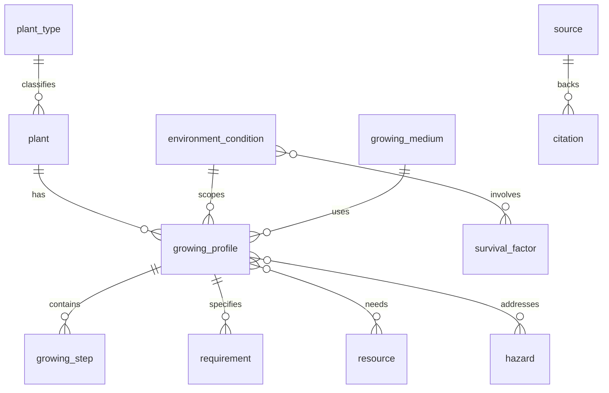

# Extreme-conditions plant database — plan

## Goals

- Store **plants**, **growing instructions**, and **context** (soil, water, light, pests, harvest) that vary by **environment profile** (home garden → drought → fallout-style ionizing radiation, contaminated water, indoor sealed systems, etc.).
- Keep the model **evidence-aware**: distinguish **verified agronomy** from **speculative/disaster-prep** notes so you do not accidentally present fiction as science.

---

## 1. Complete database schema (tables, fields, relationships)

Use a **normalized core** plus optional **JSON** for variable step lists and citations. Below is a PostgreSQL-oriented schema; SQLite works the same with fewer types.

### Core identity and taxonomy

- **`plant`** — one row per species/cultivar you care about.
  - `id` (PK), `scientific_name`, `common_names` (array or junction table), `plant_type_id` (FK), `life_cycle` (annual/perennial/biennial), `native_regions` (text or region junction), `edible_parts` (enum array or junction), `toxicity_notes` (text), `created_at`.

- **`plant_type`** — vegetable, herb, grain, legume, fruit tree, mushroom, algae, etc.
  - `id`, `name`, `description`.

- **`environment_condition`** — abstract “scenario” you can attach guidance to.
  - `id`, `code` (unique, e.g. `drought`, `indoor_hydro`, `high_radiation_speculative`), `name`, `description`, `severity_scale` (optional 1–5), `is_speculative` (bool, default false for real agronomy).

- **`survival_factor`** — cross-cutting constraints: water security, radiation shielding, soil contamination, pest pressure, temperature extremes, air quality, energy for grow lights, etc.
  - `id`, `name`, `description`.

- **Junction: `environment_condition_survival_factor`**
  - `environment_condition_id`, `survival_factor_id`, `relevance` (optional enum: primary/secondary).

### Growing knowledge (the “how to grow” engine)

- **`growing_profile`** — **the main link**: one plant under one environment (optionally narrowed by medium and hardiness).
  - `id`, `plant_id` (FK), `environment_condition_id` (FK), `medium_id` (FK → `growing_medium`, nullable), `hardiness_zone_min`, `hardiness_zone_max` (nullable), `summary` (text), `difficulty` (enum), `confidence_level` (enum: peer_reviewed / field_practice / speculative), `last_reviewed_at`.

- **`growing_medium`** — soil, raised bed, container, hydroponics, aeroponics, sand culture, etc.
  - `id`, `name`.

- **`growing_step`** — ordered instructions for a profile.
  - `id`, `growing_profile_id` (FK), `step_order` (int), `title`, `body` (text), `duration_days` (nullable), `equipment` (text or JSON).

- **`requirement`** — normalized needs you can filter on.
  - `id`, `growing_profile_id` (FK), `category` (light/water/temp/soil_ph/nutrients/spacing/harvest), `value_min`, `value_max`, `unit`, `notes`.

- **`resource`** — inputs (seeds, tools, amendments, testing kits).
  - `id`, `name`, `category`, `description`.

- **`growing_profile_resource`** — which resources a profile uses.
  - `growing_profile_id`, `resource_id`, `quantity_notes`.

- **`hazard`** — radiation, heavy metals, pathogens, mycotoxins, chemical spills, etc.
  - `id`, `name`, `description`, `mitigation_summary`.

- **`growing_profile_hazard`** — hazards relevant to that profile + mitigation text.
  - `growing_profile_id`, `hazard_id`, `mitigation_detail` (text), `evidence_notes` (text).

### Provenance and quality (strongly recommended)

- **`source`** — books, papers, extension services, government agencies.
  - `id`, `title`, `url`, `publisher`, `year`, `source_type` (peer_review / extension / grey_literature / community).

- **`citation`** — attach sources to profiles, steps, or hazard mitigations.
  - `id`, `source_id`, `target_type` (profile/step/hazard), `target_id`, `quote` (nullable), `page` (nullable).

### Optional but useful

- **`calendar_task`** — week-by-week or season-by-season tasks tied to `growing_profile`.
  - `id`, `growing_profile_id`, `week_offset` or `season`, `task`, `priority`.

- **`plant_relationship`** — companion planting, allelopathy warnings.
  - `plant_a_id`, `plant_b_id`, `relationship_type`, `notes`.

### Relationships (ER summary)

**Why this shape:** `growing_profile` is the pivot so you do not duplicate plant facts for every disaster variant; you add rows per (plant × environment × medium) instead of bloating `plant`.

---

## 2. Categories of plants and environmental conditions

### Plant categories (examples)

- **Staple calories**: grains (maize, rice, wheat), roots/tubers (potato, cassava, sweet potato), legumes (beans, lentils, peas).
- **Leafy greens**: lettuce, kale, Asian greens, spinach (with oxalate/toxicity caveats where relevant).
- **Herbs and aromatics**: basil, mint, alliums.
- **Fruits** (tree/bush/vine): where space and years-to-fruit matter.
- **Mushrooms** (separate workflow: substrate, sterility, contamination risk).
- **Microgreens / sprouts** (fast calories and vitamins; higher food-safety discipline for sprouts).
- **Algae / aquatic** (if you model closed-loop systems).

### Environmental / disaster profiles (split **real** vs **speculative**)

Use `is_speculative` on `environment_condition` so UI and exports can label them.

- **Real, well-documented agronomy**: home/field, **drought**, **flood recovery**, **saline soil**, **high heat**, **frost**, **urban contaminated soil** (with soil testing and remediation framing), **indoor low light**, **greenhouse**, **off-grid limited water**, **container-only**, **hydroponics / aquaponics**.
- **Disaster-adjacent but still engineering-realistic**: **sealed indoor with grow lights**, **water from rain capture only**, **grid-down** (energy constraint as a `survival_factor`).
- **Highly speculative / sci-fi framing** (still storeable, but must be flagged): **elevated background ionizing radiation**, “**fallout**” as a composite scenario (radiation + soil/water contamination + social breakdown). Treat these as **hypothesis + citations to real radiobiology/plant stress literature**, not prescriptive survival guarantees.

### Survival factors (cross-cutting)

- Water quantity and quality (filtration, distillation, pathogen load).
- Soil contamination (heavy metals, hydrocarbons) and testing cadence.
- Energy for lighting, pumping, climate control.
- Pest/disease pressure when inputs are scarce.
- Seed saving, genetic diversity, and replanting strategy.
- Nutrition completeness (calories vs micronutrients; anti-nutrients; toxic plants).

---

## 3. Step-by-step build plan (from scratch)

1. **Define scope and ethics**: decide you will label speculative content, prefer extension/agronomy sources for “how to grow,” and treat extreme radiation/fallout as **educational modeling** not operational advice without expert review.
2. **Freeze taxonomy**: finalize lists for `plant_type`, `environment_condition`, `survival_factor`, `growing_medium`, `hazard`.
3. **Implement schema**: migrations for all tables; unique constraints on `(plant_id, environment_condition_id, medium_id)` on `growing_profile` (adjust if you need multiple profiles per combo).
4. **Seed minimal data**: 5–10 plants, 4–6 environments, 10–20 profiles total.
5. **Build import pipeline**: CSV/JSON seed files versioned in repo; repeatable `seed` command.
6. **API or query layer**: read-heavy endpoints: filter plants by environment, medium, edible part, difficulty.
7. **Simple UI** (optional): browse plants → pick environment → see steps, requirements, hazards, citations.
8. **Validation workflow**: form for adding new `growing_profile` requiring at least one `citation` when `confidence_level` is not speculative—or always require a source URL for non-speculative rows.
9. **Testing**: constraint tests, seed integrity checks, a few golden-query tests (“drought-tolerant legumes”).
10. **Iterate content**: expand profiles slowly; prefer quality and citations over breadth.

---

## 4. Tools / tech stack (practical options)

Pick one stack; all are viable for a solo project.

| Layer | Conservative choice | Lightweight choice |
|--------|---------------------|---------------------|
| DB | **PostgreSQL** (JSONB, arrays, full-text search) | **SQLite** (single file, easy backup) |
| Backend | **Python + FastAPI** or **Node + Express** | Same |
| Migrations | **Alembic** (Python) or **Prisma/Flyway** | Same |
| Admin / CRUD | **Django Admin** or **Retool** (later) | Simple custom forms |
| Search | Postgres `tsvector` / **Meilisearch** (optional) | SQLite FTS5 |
| Frontend (optional) | **Next.js** or **Vite + React** | Static site generator |
| Versioning content | Seed SQL/CSV in git + migration history | Same |

**Minimum viable**: SQLite + FastAPI + seed JSON + a README query cheat sheet (no UI).

---

## 5. Example entries (concrete)

**`environment_condition`**

- `code: drought`, `name: Drought / water rationing`, `is_speculative: false`
- `code: indoor_hydro_grid_down`, `name: Indoor hydroponics with limited power`, `is_speculative: false` (engineering-heavy)
- `code: high_radiation_background_speculative`, `name: Elevated background radiation (modeling)`, `is_speculative: true`

**`plant`**

- `scientific_name: Amaranthus spp.`, common: amaranth, leaf protein, grain use cases
- `scientific_name: Solanum tuberosum`, potato — calorie density, container potential

**`growing_profile` (illustrative row logic)**

- Plant: potato, Environment: `drought`, Medium: `container`, Summary: deep containers, mulching, prioritize early varieties, confidence: field_practice, with extension-office citations.

**`growing_step` (short)**

1. Site/medium selection (raised beds vs containers).
2. Soil/media prep and pH targets.
3. Planting timing and spacing.
4. Irrigation strategy keyed to environment (deficit irrigation only if scientifically justified—cite).
5. Pest monitoring (low-input IPM).
6. Harvest and storage (critical for staple crops).

**`hazard` + mitigation (example tone)**

- Hazard: **mycotoxins in stored grain** — mitigation: drying targets, airtight storage, inspection; cite food-safety guidance.
- Hazard: **heavy metals in urban soil** — mitigation: testing, raised beds with imported clean soil, washing produce; cite environmental health sources.

---

## How to proceed in your repo (`d:\plant`)

1. Initialize git and choose stack (SQLite + FastAPI is fastest to value).
2. Add migration `001_initial.sql` implementing tables above.
3. Add `seeds/` with `plants.json`, `environments.json`, `profiles.json` matching FKs.
4. Implement read API: `GET /plants`, `GET /plants/{id}/profiles?environment=drought`.
5. Add a one-page UI or export (CSV) for sharing.

---

## Risk note (important for “fallout / apocalypse”)

Ionizing radiation effects on crops and food safety are **complex and regulated**; your database should store **general plant stress physiology** and **food safety limits** from authoritative sources, and clearly separate **unverified prepping lore** into speculative rows with warnings.
